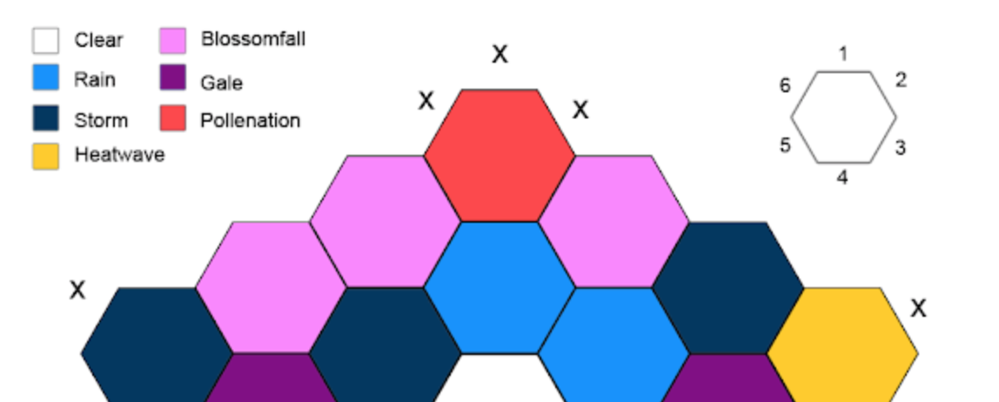

I was inspired by [Daniel Sell][inspiration]'s method for generating weather by rolling a six-sided-dice to move around on a hex grid containing the possible weather results. I am a programmer, so naturally I wanted to turn it into a React app! _rolls eyes_

[inspiration]: http://whatwouldconando.blogspot.com/2017/04/five-dimensional-weather.html

## Hexagonal grid math

Last time I made a [hexagonal board for a game][nonaga], I used a [cartesian coordinate system][hexagon]. The code to move to an adjacent is a bit weird. Sometimes you increment/decrement `x`. Sometimes you don't. It depends on the value of `y`.
Is this implementation _obviously correct_?

[nonaga]: https://github.com/royce/nonaga-terse-js
[hexagon]: https://www.redblobgames.com/grids/hexagons/

```javascript
var steps = {
  ne: function (coord) {
    return [coord[0] + (coord[1] % 2 ? 1 : 0), coord[1] - 1]; // highlight-line
  },
  e: function (coord) {
    return [coord[0] + 1, coord[1]];
  },
  // ...
  nw: function (coord) {
    return [coord[0] - (coord[1] % 2 ? 0 : 1), coord[1] - 1]; // highlight-line
  },
};
```

This time I'm using a [cubic coordinate system][hexagon]. A cool property of a cubic coordinate system is that `x + y + z = 0`.

```typescript
export const directions: CubeCoord[] = [
  [1, 0, -1],
  [1, -1, 0],
  [0, -1, 1],
  [-1, 0, 1],
  [-1, 1, 0],
  [0, 1, -1],
];
```

## Icons

Daniel's method uses colour and a legend to represent different weather. This is an excellent approach: it allows the DM to focus on _gameable_ weather and it is simple - so very simple.



I decided to add svg icons to the mix. [React-Icons][icons] has a set of clouds and suns and lightning. It's almost prefect for my purposes. Some of the weather combinations that I want are missing, so I have [stitched them together using the pieces of the original SVGs][custom-icons].
Here are my custom icons!

[icons]: https://react-icons.github.io/react-icons/icons?name=wi
[custom-icons]: https://github.com/Royce/weather-hex/blob/main/src/weather/CustomIcons.ts

<WeatherIcons />

## Everything else.

- **React hooks and functional components**. I do not miss class components at all!
- **Recoil**. I still like it more than Redux.
- **Snapshot testing**. This was an exploratory project so there is no _correct_ functionality, but I still want to know if I accidentally break something. See [options.test.ts][snapshot].
- **Typescript**. Sometimes it's annoying. There are places -- particularly when using lodash -- where it fails to infer the correct type. I like being able to use strings as constants/enums and not having to worry about typos.
- **Lodash**. As a result of limitation of `babel-plugin-lodash` ("Chain sequences aren’t supported. See this [blog post][chain-note] for alternatives"), I tried using `lodash/fp` and `flow` (instead of `_.chain`).

[chain-note]: https://medium.com/bootstart/why-using-chain-is-a-mistake-9bc1f80d51ba
[snapshot]: https://github.com/Royce/weather-hex/blob/main/src/weather/options.test.ts

Here is the final widget in all it's inelegant glory!

<WeatherHexApp />

All the code is on github at [github.com/Royce/weather-hex](https://github.com/Royce/weather-hex)
